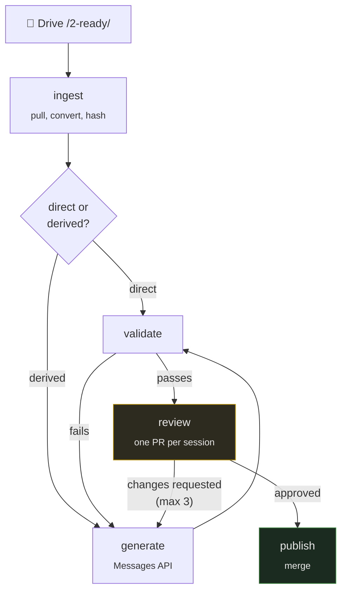

# `automation/` — the content pipeline · PRIVATE REPO

Drive → generate → review → repo.

> **Specified, not built.** No implementation code exists yet. The design below is
> settled; three decisions are still open and are listed at the end.

**The goal: one human action per session.** A reviewer reads a pull request and clicks
approve. Everything either side of that is triggered.

This directory holds the pipeline's shape, its configuration schema, and its prompts.
The prompts are the valuable part — writing them forced decisions about what a good
pre-read *is*, which is a content question the output quality rests on, not an
engineering one.

---

## The problem this solves

**Most faculty will never have repo access, and should not need it.** They have a
recording, a deck and some notes, and the material has to reach students without anyone
learning git.

So Drive is their interface, not merely an inbox.

## The four zones

A file's **folder is its state**. Moving a file is the only state transition anyone has
to learn — no forms, no status fields, no separate tracker to keep in sync.

```
📁 1-inbox-raw/     drop anything here. Nothing happens.
📁 2-ready/         MOVE a file here when it is finished  ← the trigger
📁 3-review/        the pipeline writes drafts here; faculty comment
📁 4-archive/       processed sources, kept for provenance
```

**The move is the trigger.** Dropping a file in the inbox does nothing, deliberately: a
half-uploaded recording must not start a generation run, and faculty need somewhere to
put work in progress.

## Two paths, not one

This is the thing to understand before anything else.

| | What it is | Pipeline does |
|---|---|---|
| **Direct** | A file students read — a notebook, an assignment, class notes | Convert, validate, commit. **No model involved.** |
| **Derived** | A document generated *from* direct files — a post-read, an interview bank | Generate → validate → review → commit |

**A file can be both.** A transcript is a deliverable students search *and* the input
every post-read is grounded in. That is why `config/pipeline.yaml` has two separate
lists with an `also_an_input` flag, rather than one list with a type field.

> Which documents end up in each list is still being decided. The **shape** is settled;
> moving an entry between lists is a config change.

## Why generation is inside the pipeline

The prompts already exist and are used by hand in Claude chat. That work carries over —
**the skills become system prompts for the Messages API.**

What cannot carry over is the chat step itself. A person copy-pasting input in and
output back out *is* the manual intervention this is meant to remove, and it also loses
three things worth having:

- **Provenance.** `skill_version` and source hashes in the frontmatter mean any document
  traces to the exact prompt and inputs that produced it.
- **Determinism.** Low effort variance, versioned prompts, reproducible runs.
- **Cost visibility.** `response.usage` per run, recorded in `state/`.

## The stages



| Stage | Does | Model? |
|---|---|:--:|
| **ingest** | Pull from Drive, convert to markdown, hash into `sources:` | — |
| **generate** | Produce a derived document using a versioned skill | ✅ |
| **validate** | Check against the frontmatter schema **before a human sees it** | — |
| **review** | Open one PR per session; carry feedback into the next attempt | — |
| **publish** | Merge. A human approves through a GitHub Environment | — |

Each stage is separately runnable. A pipeline that only runs end to end cannot be
debugged, and this one touches an external API, a model and two repositories.

**One PR per session, not per artefact.** A reviewer opens one thing and sees the
transcript, the notebook and the three generated documents together. Five PRs for one
session is how review stops happening.

## Why a PR is the approval mechanism

Not a custom dashboard, not a Drive comment thread. A pull request already gives you
line-level comments, a diff, history, required reviewers, and a merge button that means
something — all of it familiar to anyone who has reviewed code.

Building an approval UI would mean rebuilding that badly.

---

## Three rules that are not negotiable

### 1. Provenance on every generated file

```yaml
generated: true
generator: {skill: post-read, skill_version: 3, model: claude-opus-5, run: <url>}
sources: [{path: ..., sha256: ...}]
approved_by: some-handle
edited_by_human: false
```

Any document can be traced to the exact prompt and inputs that produced it. The source
hashes also let you detect that an input changed *after* the thing derived from it was
published.

**`approved_by` names a real human and is never set by the pipeline.** Generation and
approval are different events by different actors, and keeping them distinct is the
entire value of the gate.

**`edited_by_human: true` blocks overwriting.** Once a person edits a generated file, the
pipeline refuses to touch it. Without this interlock, a regeneration silently discards
someone's corrections — once.

### 2. Prompts are versioned artefacts

`skills/` holds prompts as files with versions, because a prompt determines what the
content *says*. An undated prompt change that silently alters three hundred documents is
not reproducible and not reviewable.

Every generated file records `skill` and `skill_version`.

### 3. The regeneration loop has a cap

Reviewer feedback is carried **into** the next attempt, not used to trigger a blind
retry. After **three attempts** it escalates to a human.

An uncapped regenerate-on-rejection loop burns budget and converges on nothing.

> The cheaper checkpoint is **before** generation — agreeing what a session should
> produce and from what. Catching a problem in the draft is the expensive place to catch
> it.

---

## Still undecided

Three, and each is a real decision rather than a detail to fill in later.

### 1. The trigger

**Preferred: Drive push notifications.** Genuinely event-driven — Drive calls a webhook
the moment a file moves into `2-ready/`.

**The obstacle:** push requires a public HTTPS endpoint that you host, and the
notification channels expire every seven days and must be renewed. GitHub Actions cannot
receive a webhook directly, so this means real infrastructure — a small always-on
service — not just another workflow file.

**The fallback, if that is not wanted:** a scheduled poll every fifteen minutes. No
infrastructure, no endpoint, no renewal. The delay costs nothing when the alternative is
a human processing it the next morning.

**Not yet decided.** The stages are written to be trigger-agnostic: whatever fires them,
`ingest` does the same thing. Choosing later changes one entry point, not the pipeline.

### 2. Which model provider

Undecided, so the generate stage constructs its client in **one place**. Direct
Anthropic API, Bedrock and Vertex all expose the same `messages.create` surface — the
difference is the client class and where the bill lands.

Switching is a config change (`model.provider` in `pipeline.yaml`), not a rewrite.

### 3. The Drive permission model

Permissions inside a Google shared drive are **strictly expansive** — a member's role
cannot be *reduced* for a subfolder. So "faculty can edit `2-ready/` but only comment on
`3-review/`" is impossible within one drive.

| Option | Gives you | Costs |
|---|---|---|
| **Two shared drives** | Real enforcement — faculty genuinely cannot edit a draft | Two bookmarks instead of one |
| **One drive, convention** | Simpler setup | No enforcement; the pipeline detects edits by content hash and flags them |

This changes the setup instructions faculty receive, so it is worth deciding before the
ingest stage is written.

### Settled

- **Generation is in the pipeline**, via the Messages API, using the existing skills
- **One PR per session**, reviewed as a unit
- **Approval is a GitHub PR review** — free line comments, diff, history, and a merge
  that means something
- **Three regeneration attempts**, carrying reviewer feedback, then escalate

## Layout

```
automation/
├── config/    sources.yaml · pipeline.yaml · approvers.yaml   (NOT credentials)
├── skills/    eight prompts, versioned
├── src/       ingest · generate · validate · review · publish
├── state/     run records — the audit trail
└── tests/
```

## Credentials

**Never files.** Not here, not in `config/`, not anywhere in any repository. Org or repo
secrets only.

`config/` holds settings — folder ids, approver handles, model parameters. The service
account key is a secret.

## Documentation

- [`docs/03-automation/`](../../docs/03-automation/) — the pipeline for staff, written
  for someone who will never open a terminal
- [`docs/01-authoring/frontmatter.md`](../../docs/01-authoring/frontmatter.md) — the
  provenance contract
- [`docs/09-design-notes/drive-layer-design.md`](../../docs/09-design-notes/drive-layer-design.md)
  — why the Drive layer is shaped this way, including the permission constraint that
  changed the original design
