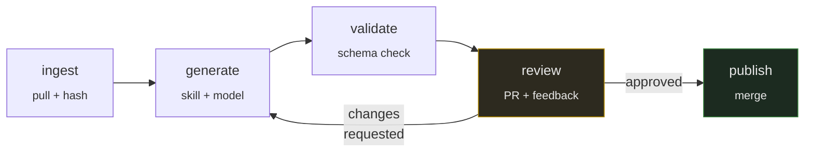

# `automation/` — the content pipeline · PRIVATE REPO

Drive → generate → review → repo.

> **Scaffolding only, and whether to build it is itself an open question.**
> No implementation code exists, deliberately. See
> [STATUS.md](../../docs/09-design-notes/STATUS.md#the-content-pipeline--a-decision-not-a-gap)
> for why, and what would need deciding first.

This directory holds the pipeline's shape, its configuration schema, and its prompts.
The prompts are the valuable part — writing them forced decisions about what a good
pre-read *is*, which is a content question the output quality rests on, not an
engineering one.

---

## The problem this solves

**Most faculty will never have repo access, and should not need it.** They have a
recording, a deck and some notes, and the material has to reach students without anyone
learning git.

So Drive is their interface, not merely an inbox.

## The four zones

A file's **folder is its state**. Moving a file is the only state transition anyone has
to learn — no forms, no status fields, no separate tracker to keep in sync.

```
📁 1-inbox-raw/     drop anything here. Nothing happens.
📁 2-ready/         MOVE a file here when it is finished  ← the trigger
📁 3-review/        the pipeline writes drafts here; faculty comment
📁 4-archive/       processed sources, kept for provenance
```

**The move is the trigger.** Dropping a file in the inbox does nothing, deliberately: a
half-uploaded recording must not start a generation run, and faculty need somewhere to
put work in progress.

## The five stages



| Stage | Does |
|---|---|
| **ingest** | Pull from Drive, hash every source into `sources:` provenance |
| **generate** | Produce a draft using a versioned skill |
| **validate** | Check against the frontmatter schema **before a human sees it** |
| **review** | Open a PR; carry reviewer feedback into the next attempt |
| **publish** | Merge. A human approves through a GitHub Environment |

Each stage is separately runnable. A pipeline that only runs end to end cannot be
debugged, and this one touches an external API, a model and two repositories.

## Why a PR is the approval mechanism

Not a custom dashboard, not a Drive comment thread. A pull request already gives you
line-level comments, a diff, history, required reviewers, and a merge button that means
something — all of it familiar to anyone who has reviewed code.

Building an approval UI would mean rebuilding that badly.

---

## Three rules that are not negotiable

### 1. Provenance on every generated file

```yaml
generated: true
generator: {skill: post-read, skill_version: 3, model: claude-opus-5, run: <url>}
sources: [{path: ..., sha256: ...}]
approved_by: some-handle
edited_by_human: false
```

Any document can be traced to the exact prompt and inputs that produced it. The source
hashes also let you detect that an input changed *after* the thing derived from it was
published.

**`approved_by` names a real human and is never set by the pipeline.** Generation and
approval are different events by different actors, and keeping them distinct is the
entire value of the gate.

**`edited_by_human: true` blocks overwriting.** Once a person edits a generated file, the
pipeline refuses to touch it. Without this interlock, a regeneration silently discards
someone's corrections — once.

### 2. Prompts are versioned artefacts

`skills/` holds prompts as files with versions, because a prompt determines what the
content *says*. An undated prompt change that silently alters three hundred documents is
not reproducible and not reviewable.

Every generated file records `skill` and `skill_version`.

### 3. The regeneration loop has a cap

Reviewer feedback is carried **into** the next attempt, not used to trigger a blind
retry. After **three attempts** it escalates to a human.

An uncapped regenerate-on-rejection loop burns budget and converges on nothing.

> The cheaper checkpoint is **before** generation — agreeing what a session should
> produce and from what. Catching a problem in the draft is the expensive place to catch
> it.

---

## Still undecided

Recorded honestly, because these are the decisions that will shape the build:

| Question | Options | Notes |
|---|---|---|
| **Drive auth** | Service account added to the shared drive · domain-wide delegation | Prefer the service account: DWD is a much broader grant and harder to justify |
| **Trigger** | Poll Drive on a schedule · Drive push notifications | Polling is simpler and a 15-minute delay costs nothing here |
| **Drive permissions** | Two shared drives · one drive with convention | Permissions inside a shared drive are strictly *expansive* — a member's role cannot be reduced for a subfolder, which rules out "comment-only on `3-review/`" in a single drive |
| **Skill granularity** | One skill per artefact · one pass producing several | One per artefact is easier to review and to version; costs more tokens |
| **Where drafts land** | A branch per session · a branch per artefact | Per session gives one PR to review, which is likely better for faculty |
| **Failure handling** | Retry, escalate, or drop | Currently `escalate` after 3. Untested |

## Layout

```
automation/
├── config/    sources.yaml · pipeline.yaml · approvers.yaml   (NOT credentials)
├── skills/    eight prompts, versioned
├── src/       ingest · generate · validate · review · publish
├── state/     run records — the audit trail
└── tests/
```

## Credentials

**Never files.** Not here, not in `config/`, not anywhere in any repository. Org or repo
secrets only.

`config/` holds settings — folder ids, approver handles, model parameters. The service
account key is a secret.

## Documentation

- [`docs/03-automation/`](../../docs/03-automation/) — the pipeline for staff, written
  for someone who will never open a terminal
- [`docs/01-authoring/frontmatter.md`](../../docs/01-authoring/frontmatter.md) — the
  provenance contract
- [`docs/09-design-notes/drive-layer-design.md`](../../docs/09-design-notes/drive-layer-design.md)
  — why the Drive layer is shaped this way, including the permission constraint that
  changed the original design
