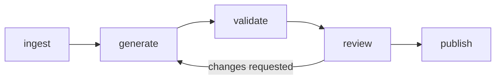

# `src/` — the pipeline stages · PRIVATE REPO

**No implementation code yet.** Each directory describes what its stage will do.

| Stage | Reads | Writes |
|---|---|---|
| [`ingest/`](ingest/) | Drive `2-ready/` | Local sources + hashes |
| [`generate/`](generate/) | Sources, skills | Drafts with provenance |
| [`validate/`](validate/) | Drafts | Pass, or problems back to generate |
| [`review/`](review/) | Validated drafts | A PR, approval or escalation |
| [`publish/`](publish/) | Approved PR | Merged content |

Each stage is **separately runnable**. A pipeline that only runs end to end cannot be
debugged, and this one touches an external API, a model and two repositories.
