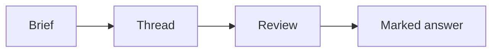

# Style guide

Voice and formatting for every document in this repository.

This exists because most content will eventually be generated, and the
[skill prompts](../../_staging-private-repo/automation/skills/) need a written standard
to point at. **They reference this file rather than restating its rules** — one place to
change, and no drift between eight prompts.

---

## Voice

**Second person, for anything a reader does.** "You will build a retrieval baseline",
not "students will build" or "one builds".

**Plain language.** If a shorter word works, use it. `use` over `utilise`, `start` over
`commence`, `about` over `approximately` unless precision matters.

**Short sentences.** If a sentence needs a semicolon and two commas, it is two
sentences.

**British English.** *Recognise*, *behaviour*, *colour*, *analyse*. Not *whilst* — it is
archaic; use *while*.

**No filler.** Delete on sight:

> ~~It is important to note that~~ · ~~As we saw earlier~~ · ~~In this section we will~~
> · ~~It should be mentioned~~ · ~~Simply~~ · ~~Just~~ · ~~Obviously~~

*Simply*, *just* and *obviously* are worse than filler — they tell a stuck reader the
thing they cannot do is easy.

**Do not hedge what is plainly true.** If an approach is wrong, say it is wrong. Not
"may not always be optimal".

**Warmth is not padding.** Encouragement that says nothing ("Great job getting this
far!") reads as filler in a technical document. Warmth that carries information ("Being
stuck here is normal — the arithmetic is genuinely fiddly") earns its place.

---

## Structure

**One `#` per file**, matching the title in frontmatter.

**`##` for sections, `###` for subsections.** Do not skip a level, and do not go past
`####` — if you need a fifth level, the document wants splitting.

**Headings say what the section contains**, not what it is called. "The part that is
easy to get wrong" beats "Common pitfalls".

**Lead with the answer.** A reader skimming should get the point from the first
sentence of a section. Context comes after, not before.

**Tables for anything with two or more dimensions.** A comparison written as prose is a
comparison nobody reads.

---

## Learning objectives

Written as things the reader will be able to **do**, not topics that will be
**covered**. This is what makes an objective checkable — and what makes a generated
document auditable, since each objective either has supporting content or it does not.

| ❌ Topic | ✅ Capability |
|---|---|
| Understand embeddings | Explain what a similarity score does and does not tell you |
| Learn about chunking | Predict which chunking strategy loses an answer that spans a boundary |
| Cover evaluation | Measure a baseline honestly and say where it fails |

Two to five per document. More than five and none of them is the point.

---

## Code

**Complete and runnable.** No `...` standing in for a line that matters.

**Always language-tagged**, so it highlights:

````
```python
scores = {term: 0 for term in query}
```
````

**Show output when the output is the point.** A retrieval example without its results
is a claim, not a demonstration.

**Errors as text, never screenshots.** A screenshot cannot be searched, copied into a
reply, or read on a phone.

## Diagrams

**Mermaid, not images.** It renders natively on GitHub, diffs as text, and does not rot
when someone renames a file.

Use one when the **relationship** is the content — a flow, a state machine, a
dependency. Do not use one to decorate a list.



Keep labels short. A diagram that needs a paragraph in each box is a table.

## Links

**Relative, always.** Write `[the rubric](../rubrics/A01-slug.md)` — never a full
`github.com` URL — full URLs break when the repository moves to the organisation.

**Link text says where it goes.** Never "click here" or a bare URL.

**Link, do not restate.** If the brief says it, link the brief. A summary here will
drift from it, and then two documents disagree.

## Callouts

GitHub alerts, used sparingly — one or two per document. They cannot be nested inside
tables or HTML blocks.

```markdown
> [!NOTE]      Useful, not critical
> [!IMPORTANT] The reader will get it wrong without this
> [!WARNING]   Something irreversible or damaging
```

If every paragraph is a callout, none of them is.

---

## Every claim needs a source

**In generated content this is enforced**, and it is the constraint that makes generated
documents publishable at all:

- Never invent a number, name, date, version or result
- If the source says "about eighty per cent", write "about 80%" — not "80.4%"
- Never attribute anything to a named student
- **When uncertain, leave it out and mark the gap.** A reviewer would rather see an
  honest gap than a longer document they must fact-check line by line

In hand-written content the same rule applies with judgement: state what you know, and
say when you are unsure.

## Numbers and dates

- **Dates**: `YYYY-MM-DD` in frontmatter; "22 January 2026" in prose
- **Times**: 24-hour, with the timezone — `19:00 IST`
- **Numerals from 10 up**; words below, except with units (`3 hours`, `5 MB`)
- **Ranges with an en dash**: `15–25 minutes`

## Naming

| Thing | Convention | Example |
|---|---|---|
| Session folder | `S<NN>-<YYYY-MM-DD>-<slug>` | `S07-2026-09-13-retrieval-basics` |
| Activity | `A<NN>-<slug>.md` | `A12-retrieval-baseline.md` |
| Case study | `CS-<NN>-<slug>.md` | `CS-01-index-was-fine.md` |
| Notice | `YYYY-MM-DD-<slug>.md` | `2026-01-16-deadline-moved.md` |
| Coding question | `CQ-<NNN>-<slug>.md` | `CQ-007-deduplicate.md` |

Slugs are lowercase, hyphenated, no dates or numbers already in the prefix.

**Ids are permanent.** Renaming one breaks every link, label and bot machine-tag that
references it — including tags already posted in threads, which cannot be rewritten.

---

## Length

| Document | Target |
|---|---|
| Pre-read | 15–25 min · 800–1,200 words |
| Post-read | 10–20 min · 600–1,000 words |
| Case study | 20–30 min |
| FAQ entry | Answer in the first sentence; whole thing under 400 words |
| Notice | Under 200 words. It is read on a phone |
| Activity brief | As long as it needs; every section earns its place |

A document over its target is competing with the thing it supports.

## Before you publish

- [ ] Frontmatter complete, values in the taxonomy
- [ ] One `#`, no skipped heading levels
- [ ] Objectives are capabilities, not topics
- [ ] Code blocks tagged, complete, runnable
- [ ] Links relative, and they resolve
- [ ] No *simply*, *just*, *obviously*
- [ ] No real names
- [ ] Every number traceable
- [ ] Read it aloud — if you run out of breath, the sentence is too long
