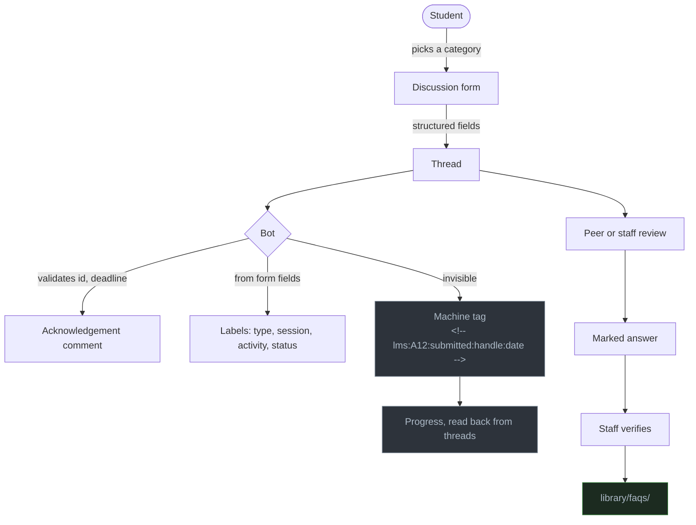

# Discussions — for faculty

How to run the forum. Written so a new TA can take over triage on day one.

The student-facing version is [discussions-for-students.md](discussions-for-students.md).
Read it too — you will be answering questions about it.

---

## The architecture

**There is no database.** Progress is tracked by a machine tag written into each bot
comment. Reading progress is reading threads back — nothing to sync, nothing that can
drift out of date with what actually happened.

---

## Categories, and why each format

Full definitions in [`.config/discussion-categories.yaml`](../../.config/discussion-categories.yaml).

> ⚠️ **A category's format is permanent.** `ANSWER` cannot become `DISCUSSION` later
> without deleting and recreating the category, which orphans its threads. Categories
> also cannot be created by API — they are made by hand in Settings.

| Category | Format | Why this format |
|---|---|---|
| Announcements | ANNOUNCEMENT | Staff-post-only. A notice channel anyone can post in is not one |
| Weekly Standup | ANNOUNCEMENT | Bot-authored; the cohort's heartbeat |
| Q&A — General | ANSWER | Marked answers drive the FAQ harvest and next-batch reuse |
| Doubts — Session | ANSWER | Answerable, and findable by everyone in that session |
| Assignments | ANSWER | The thread is the deliverable; marked feedback becomes a worked example |
| Coding Questions | ANSWER | Best solution gets marked and stays useful |
| Help Desk | ANSWER | Definite resolution; different watchers, different urgency |
| Self-Work & Practice | DISCUSSION | No single right answer — an unmarked ANSWER thread reads as a backlog |
| Show & Tell | DISCUSSION | Nothing to answer |
| Study Group | DISCUSSION | Students need somewhere that is theirs. Staff-light on purpose |
| Feedback | DISCUSSION | Marking a reply as "the answer" to a complaint is the wrong signal |
| Polls | POLL | One click is the only feedback most students will ever give |

## Labels — who applies what

Two axes: the **category** says what kind of post, the **label** says what it is about.
The same label set is shared with issues, so one query spans both surfaces.

**The bot applies** (from form fields — students have read access and cannot label):
`type:*`, `session:*`, `activity:*`, `status:needs-answer`, `status:overdue`

**You apply by hand**, and each has a purpose worth understanding:

| Label | What it is for |
|---|---|
| `good-first-answer` | Grows the answering culture. Says "a peer can take this" — not a way to deflect staff work |
| `faq-candidate` | Flags for harvest into `library/faqs/`. Cheap to add, expensive to reconstruct later |
| `worked-example` | A staff-authored model of a good question or answer. **Always footered as faculty-written** |
| `retracted` | A claim that turned out wrong, kept visible with the correction attached. Deleting teaches nobody and erases the most instructive threads |
| `status:needs-staff` | Escalated. Also set by `/staff` |
| `peer-review-owed` | This student owes a review on someone else's submission |

---

## Daily triage

The operational core. Ten minutes, and it is what keeps the forum trusted.

- [ ] **`is:unanswered` sorted oldest first.** Work from the top.
- [ ] **Anything `status:needs-staff`** — someone escalated, or the bot did.
- [ ] For each: answer it, **or** label `good-first-answer` and leave it a day for peers.
- [ ] **Mark the answer** when a thread resolves. An unmarked resolved thread is
      invisible to the FAQ harvest and helps nobody afterwards.
- [ ] **Verify** answers that are *correct*, not merely accepted. Verified is the tier
      GitHub treats as trustworthy and the tier the FAQ harvest reads.
- [ ] Add `faq-candidate` when a question will obviously recur.

**Weekly:**

- [ ] Review everything labelled `faq-candidate`
- [ ] Check the overdue list and the peer-review-owed list
- [ ] Skim **Feedback** — and reply in it, or it stops being used
- [ ] Confirm the standup thread posted

## When to answer and when to wait

A real judgement call, worth writing down.

> **Leaving a peer-answerable question for a day builds the culture.
> Leaving a blocked student for a day loses them.**

Distinguish them by what is at stake, not by how hard the question is:

| Situation | Do |
|---|---|
| Conceptual question, no deadline pressure | Label `good-first-answer`, wait a day |
| Student cannot run the code, assignment due in two days | Answer now |
| Access or login problem | Answer now. They are fully blocked |
| Interesting question several people would learn from | Wait — but come back |

**`good-first-answer` is how you make waiting visible.** Without it, a deliberate pause
is indistinguishable from being ignored, and the student cannot tell the difference.

If nobody has answered within a day, answer it yourself. The label is an invitation, not
a handoff.

---

## Reviewing a submission

**Read the approach before the code.** The form puts it first for the same reason —
review the thinking, because that is what the author can still learn from.

Then: the rubric, in order, criterion by criterion. Say which criterion each comment is
about, so the author knows whether it affects their mark.

**Saying a submission is wrong without discouraging the next one:**

- Name one thing that works first. Not politeness — it tells them what to keep.
- Be specific. "The retry loop has no cap" is actionable; "error handling could be
  better" is not.
- Where you disagree, ask. "Would a synonym list really fix #3?" invites a response, and
  occasionally you are the one who is wrong.
- Do not rewrite their code. One sentence on what you would have done differently.

## What the bot does on your behalf

Every automated behaviour, its trigger, and how to stop it. **You must never be
surprised by something posted under the organisation's identity.**

| Trigger | Behaviour | Workflow |
|---|---|---|
| Thread created | Acknowledges, validates ids and deadline, labels, writes a machine tag | `discussions-bot.yml` |
| Comment with a command | Runs it, replies | `discussions-bot.yml` |
| Daily | Deadline reminders, overdue labels, **unanswered-thread escalation** | `due-dates.yml` |
| Monday | Posts the standup thread | `weekly-standup.yml` |
| Notice merged | Posts it to Announcements | `notices.yml` |
| Brief merged | Creates or re-syncs the activity thread | `publish-activity.yml` |
| Sunday | Drafts FAQ entries from verified answers as a PR | `faq-harvest.yml` |

**The bot never answers questions.** See [bot-policy.md](bot-policy.md).

### 🔴 The kill switch

**Settings → Secrets and variables → Actions → Variables → `BOT_ENABLED` = `false`**

Every job checks it. Takes effect on the next run, no commit needed.

### How to spot a bot loop

Repeated near-identical bot comments, seconds apart, on one thread. The guard in
`discussions-bot.yml` prevents it by refusing to react to any bot actor — but if you
ever see it, set `BOT_ENABLED=false` first and diagnose afterwards.

---

## Escalation and moderation

**Prefer hiding to deleting.** Hiding keeps the record with a stated reason; deletion
erases it. The exception is genuinely harmful content — personal information, abuse —
which is deleted.

| Situation | Do |
|---|---|
| Off-topic or duplicate | Comment with a pointer, hide as `outdated` |
| Heated but recoverable | Comment naming the behaviour, not the person |
| Code of Conduct breach | Hide, then handle privately. Do not debate it in-thread |
| Personal or sensitive matter | Move it out of public view immediately |
| Wrong answer posted confidently | Reply with the correction, label `retracted`. **Do not delete it** |

The batch owner decides on anything involving removal from the batch.

## The dual-home rule — restated

> **The repo file is canonical. The thread is a published copy.**

**The failure mode:** a well-meaning TA in week two spots a typo in a published brief and
fixes it *in the thread*. Now the file and the thread disagree, and students cannot tell
which is current.

**Correcting a published brief:**

1. Open a PR against the file in `activities/briefs/`
2. Merge it
3. `publish-activity.yml` re-syncs the thread body and comments saying what changed

Never edit the brief text in the thread. Not even a typo.

## Seeding worked examples

The forum needs examples before it has any. Post a model question and a model answer,
label them `worked-example`, and **footer them as faculty-written**:

> *Posted by faculty as an example of a well-formed question.*

**Never impersonate a student.** It is dishonest, it will be found out, and the trust it
costs is not recoverable.

## Known failure modes

Stated plainly, because each one has killed a cohort forum before:

1. **Unanswered questions.** The main way a cohort stops trusting a forum. Watch
   `is:unanswered` daily — this is why the escalation job exists.
2. **A bot that answers wrongly.** Worse than one that stays silent, because it carries
   the repository's authority.
3. **Duplicate threads.** Students do not search. Link the original rather than closing
   silently — closing without explanation reads as dismissal.
4. **New threads instead of replies** on an assignment. Redirect gently; it is a
   discoverability problem, not carelessness.
5. **Feedback nobody replies to.** Gets used twice, then abandoned. Reply even when the
   answer is "not this batch".
