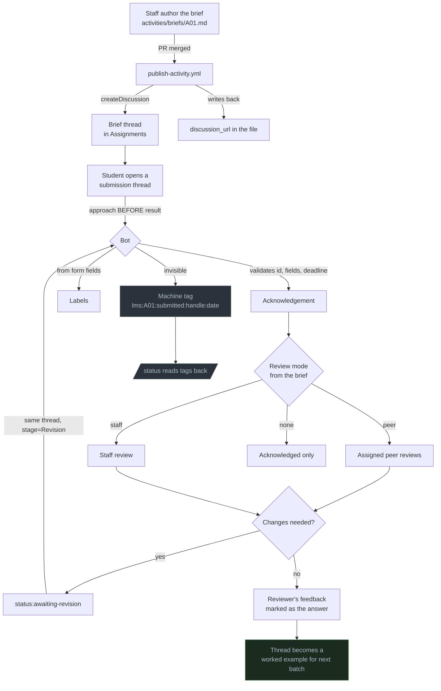

# The submission loop

Brief → thread → submit → review → revise → marked answer.

Referenced by both the [student guide](discussions-for-students.md) and the
[faculty guide](discussions-for-faculty.md).

---

## The loop

---

## Why it is shaped this way

### The thread is the deliverable

Not the file. An activity is a Discussion thread because a thread captures the approach,
the wrong turn and the correction — and a file drop captures only the final artefact.

The reasoning is the part worth reading later, including by the person who wrote it.

### The approach comes before the result

The submission form asks for your approach **above** your work, and this is not a
formatting preference.

> An approach written after the result is a reconstruction of one.

Writing the plan first makes it a plan. It is also the part a reviewer learns most from,
which is why review starts there.

### Revisions stay in the same thread

Stage **Revision** in the same thread, never a new one. The review history, the original
approach and the correction belong together — that sequence is the most instructive thing
in the whole submission, and splitting it across threads destroys it.

### The dual-home rule

> **The repo file is canonical. The thread is a published copy.**

A correction is a PR to the file; the action re-syncs the thread and comments saying what
changed. Never edit the brief text in the thread — two divergent versions and students
trust neither.

---

## What each participant does

| | Student | Bot | Reviewer | Staff |
|---|:---:|:---:|:---:|:---:|
| Open the brief thread | | ✓ | | |
| Submit | ✓ | | | |
| Acknowledge, validate, label | | ✓ | | |
| Review | | | ✓ | ✓ |
| Request changes | | | ✓ | ✓ |
| Revise | ✓ | | | |
| Mark the answer | ✓ | | | |
| Verify the answer | | | | ✓ |

**The bot never reviews, grades, or judges quality.** It checks that fields are filled
and ids are real. A human does the rest — see [bot-policy.md](bot-policy.md).

## Timing

| Stage | Expected |
|---|---|
| Acknowledgement | Minutes |
| Deadline reminders | 3 days and 1 day before |
| Peer review assigned | After the deadline |
| Overdue label | Due date + grace period |
| Unanswered escalation | 24 hours with no reply |

All configured in [`.config/batch.yaml`](../../.config/batch.yaml) under `deadlines:`.
