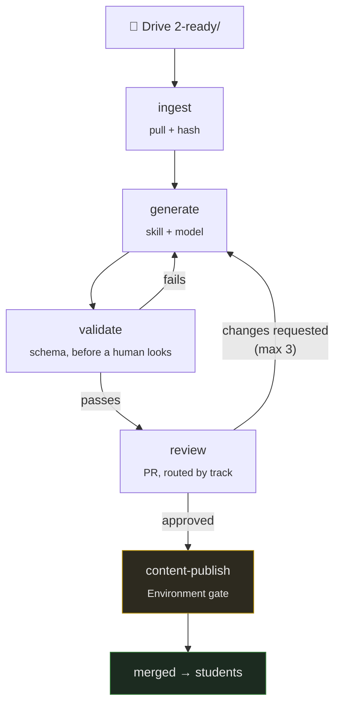

# The content pipeline

For staff who need to understand or change how generated content is produced.

Faculty who just want to hand in material should read
[drive-guide.md](drive-guide.md) instead.

> **Scaffolding only.** The shape, configuration and prompts exist; no implementation
> code does. What is undecided is listed at the end, honestly.

---

## The shape



## Why it is shaped this way

**Faculty never touch git.** Drive is the interface, and a file's folder is its state —
one thing to learn, no forms, no tracker to keep in sync.

**A pull request is the approval mechanism.** Not a custom dashboard: a PR already has
line comments, a diff, history, required reviewers and a merge that means something.
Building an approval UI would mean rebuilding all of that, worse.

**Validation runs before a human sees the draft.** A reviewer's attention is for whether
the content is *right* — no validator can check that, and no human should be spending it
on a missing frontmatter field.

**Two gates, because they ask different questions.** The PR review asks "is this
content correct". The Environment gate asks "should this be published now". GitHub
enforces the second, not our code.

---

## The provenance contract

Every generated file carries this, and it is the reason generated content is publishable
at all:

```yaml
generated: true
generator:
  skill: post-read
  skill_version: 3
  model: claude-opus-5
  run: https://github.com/.../actions/runs/123456789
sources:
  - path: batch/sessions/S07-.../transcript.md
    sha256: e3b0c44298fc1c14...
approved_by: some-handle
edited_by_human: false
```

| Field | Answers |
|---|---|
| `generator` | Which prompt version and model produced this |
| `sources` | What it was made from — and, via the hash, whether that has since changed |
| `approved_by` | **Which human signed it off.** Never set by the pipeline |
| `edited_by_human` | Whether a person has edited it — `true` blocks overwriting |

**`approved_by` and `generated` are separate on purpose.** Generation and approval are
different events by different actors. A generated file nobody approved must stay
distinguishable from one a named person signed off.

**`edited_by_human: true` is an interlock.** Without it, a regeneration silently discards
someone's corrections — once, and then they stop trusting the system.

---

## Skills are versioned prompts

`automation/skills/` holds one file per artefact type. A prompt determines what the
content *says*, so an undated change that silently alters three hundred documents is
neither reproducible nor reviewable.

| Skill | Produces | Requires | Review |
|---|---|---|:--:|
| `transcript-clean` | Cleaned transcript | transcript | light |
| `notes` | Session notes | transcript | standard |
| `post-read` | Post-read | transcript | careful |
| `pre-read` | Pre-read | deck | **careful** |
| `faq` | FAQ entries | transcript or verified thread | standard |
| `interview-questions` | Question bank entries | transcript | standard |
| `coding-questions` | Practice problems | transcript + code | careful |
| `case-study` | Case study | notes | careful *(disabled)* |

**`pre-read` is the riskiest** and gets the strictest rules: there is no transcript,
because the session has not happened. It is generated from a deck — fragmentary by
nature — and the temptation to fill gaps with plausible general knowledge is exactly
what produces a document the session then contradicts.

**`case-study` is disabled by default**, honestly. A case study needs a real surprise,
and a transcript usually does not contain one. Generating from thin material produces a
story with a moral and no mechanism.

## Grounding rules, shared by every skill

- Never invent a number, name, date, version or result
- Never name a student — sources may contain names; they must not propagate
- Never add material to make a document more complete. Fidelity, not completeness
- **When uncertain, leave it out and mark the gap.** A reviewer would rather see an
  honest gap than a longer document they must fact-check line by line

That last rule is what makes review tractable. The gaps tell the reviewer where to look.

---

## The regeneration loop

Reviewer feedback is carried **into** the next attempt rather than triggering a blind
retry — passing the reviewer's actual words back into the prompt is what makes attempt
two better than attempt one.

**Capped at three attempts, then escalated.** An uncapped regenerate-on-rejection loop
burns budget and converges on nothing.

> The cheaper checkpoint is **before** generation: agreeing what a session should
> produce and from what. Catching a problem in the draft is the expensive place.

## Adding a new artefact type

1. Write the skill in `automation/skills/<name>.md` — role, input contract, output
   structure with frontmatter, grounding rules, style, a worked example, non-goals, and
   a final checklist.
2. Add the frontmatter schema to
   [`docs/01-authoring/frontmatter.md`](../01-authoring/frontmatter.md).
3. Add the type to `.config/taxonomy.yaml` under `artefact_types`.
4. Add an entry to `automation/config/pipeline.yaml`: skill, `requires`, `produces`,
   review level.
5. Add validator rules to `lmskit.validate` for anything machine-checkable.
6. Add it to a `session_types` list.

The skill is the hard part and the valuable one. Writing it forces you to say what a
good version of that artefact *is* — a content decision, not an engineering one.

---

## Still undecided

| Question | Leaning | Why it is open |
|---|---|---|
| Drive auth | Service account on the shared drive | Domain-wide delegation is a much broader grant |
| Trigger | Poll every 15 min | Simpler than push notifications; the delay costs nothing |
| Drive permissions | Two shared drives | Permissions inside one drive are strictly *expansive* — a role cannot be reduced for a subfolder, so "comment-only on `3-review/`" is impossible in a single drive |
| Skill granularity | One per artefact | Easier to review and version; costs more tokens |
| Branch strategy | One per session | One PR for faculty to review, rather than five |

## Cost

`pipeline.yaml` caps input tokens per run, runs per day, and chunks any transcript over
the limit rather than truncating — truncation silently drops the end of a session, which
is usually where the summary is.

Every run records its cost in `automation/state/`.
