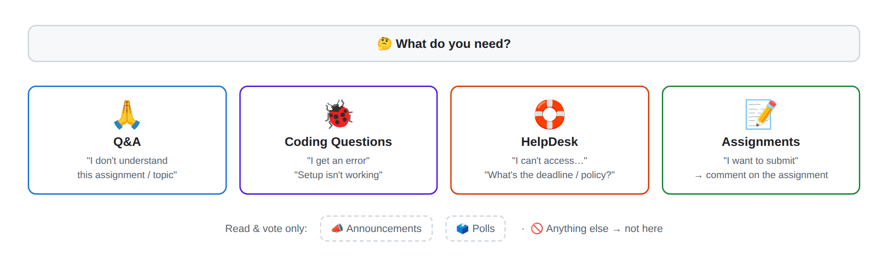
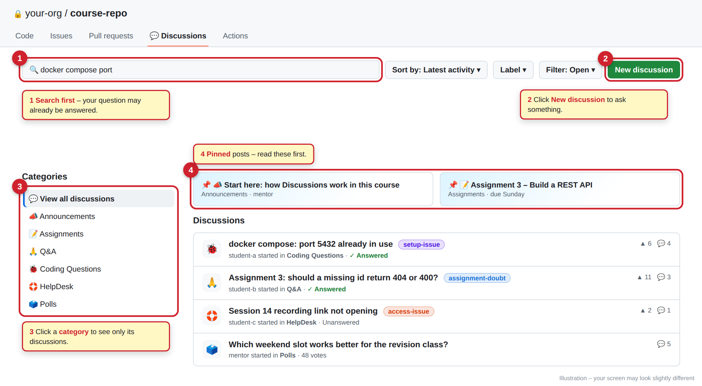
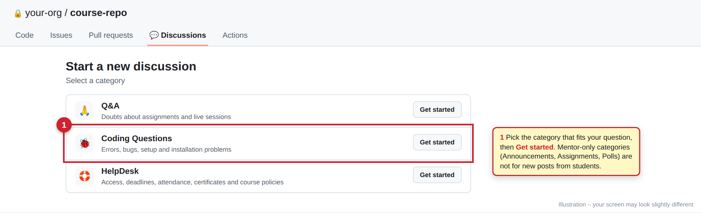
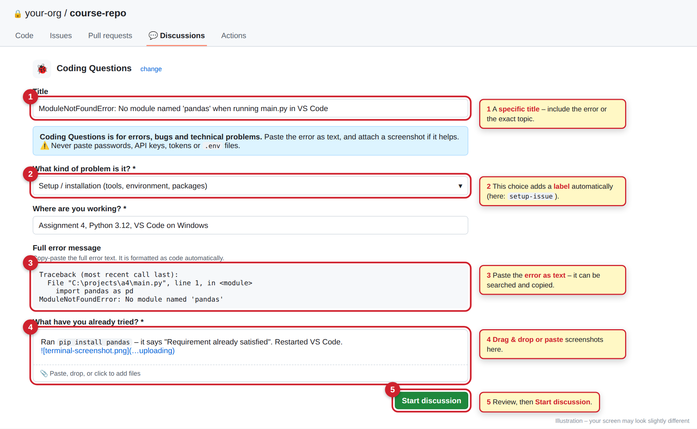
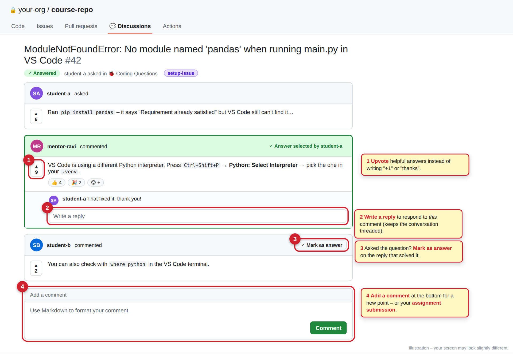
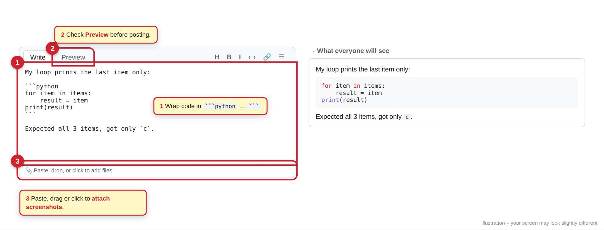
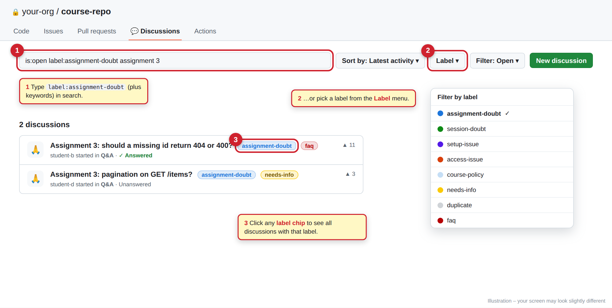

# 💬 Discussions: visual guide

## 1. Pick the right category

| | Category | Who posts |
|---|---|---|
| 📣 | Announcements | Mentors |
| 📝 | Assignments | Mentors (you **comment** to submit) |
| 🙏 | Q&A | Everyone |
| 🐞 | Coding Questions | Everyone |
| 🛟 | HelpDesk | Everyone |
| 🗳️ | Polls | Mentors (you vote) |

## 2. Find your way around

- 🔔 **Watch** → *Custom* → ✅ Discussions
- 📌 Pinned posts = read first

## 3. Start a discussion

- 🔍 Search first
- 🎯 Specific title
- 📋 Errors as text, 📸 screenshots as extras

## 4. Reply, submit, answer

| Want to… | Use |
|---|---|
| Respond to one comment | **Write a reply** (2) |
| Submit an assignment / new point | **Add a comment** (4) |
| Agree / say thanks | 👍 react or ▲ upvote (1) |
| Close your question | **Mark as answer** (3) |

## 5. Format code and screenshots

## 6. Labels

| Label | Means |
|---|---|
| `assignment-doubt` | Assignment doubt |
| `session-doubt` | Session / recording doubt |
| `setup-issue` | Install / environment |
| `access-issue` | Can't access something |
| `course-policy` | Deadlines, attendance, certificates |
| `needs-info` | ⏳ Mentor needs more details from you |
| `duplicate` | Already answered, see the link |
| `faq` | ⭐ Great answer |

- 🏷️ Labels are added automatically from your form answer, or by mentors

## 7. Do's ✅ and Don'ts 🚫

| ✅ Do | 🚫 Don't |
|---|---|
| Search before posting | Post the same question twice |
| One question per discussion | Post "Doubt" / "Help" titles |
| Error as text + code block | Paste your whole project |
| Mark the answer | Comment "+1" / "same" (upvote instead) |
| Edit your post to update it | Post in the wrong category |
| Explain ideas to peers | Share full assignment solutions in Q&A |
| Keep it about the course | Chat, memes, off-topic |

## 8. Rules

- 🤝 Be respectful. No insults, mockery or harassment
- 🔐 Never post passwords, API keys, tokens or `.env` files
- 🙈 No personal info (phone, email, payment, ID)
- 📝 No copying others' submissions
- 📢 No spam, promotions or unrelated links
- 🧑‍🏫 Follow mentor decisions (move, close, lock)

**If you break a rule:** 🗑️ post hidden or deleted → ⚠️ warning → ⛔ access removed
